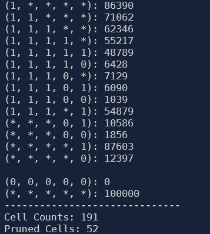

# BUC Iceberg Cube

An implementation of the Bottom-Up Computation (BUC) algorithm for computing Iceberg cube.

* Each record of the dataset consists of numbers between 0 to 19 as items wich represent 5 dimentions (A to E). each dimention has 2 values: "1" for presence of that dimention in record or "0" for absence. for example the record: "0 1 5 10" means presence of A, B and C dimentions and absence of the rest.

* Minimum Support is set in `main` function.

* Must execute on python>=3.9.

The implementation is based on "K. Beyer and R. Ramakrishnan, Bottom-up computation of sparse and Iceberg CUBE" [Paper](https://dl.acm.org/doi/abs/10.1145/304182.304214).

----------------------

### Output example:

